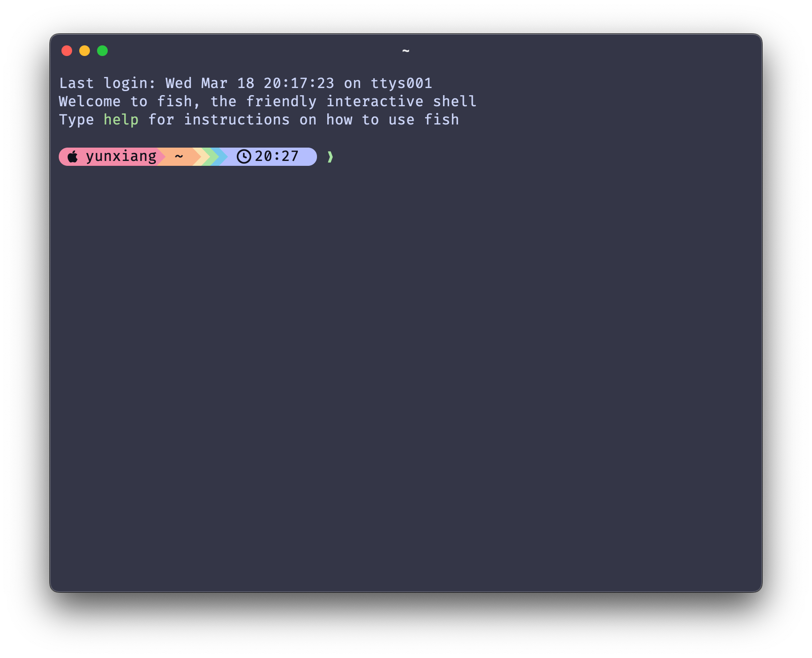

# Ghostty Setup

A beautiful and efficient terminal configuration for Ghostty with Starship prompt.

## Features

- 🎨 **Catppuccin Theme** - Beautiful Macchiato color scheme
- ⚡ **Starship Prompt** - Fast and customizable shell prompt
- 🖥️ **Modern Terminal** - Ghostty with smooth animations and transparency
- ⌨️ **Productive Shortcuts** - Tabs, splits, and quick terminal access
- 📦 **Multi-language Support** - Detects Python, Node.js, Rust, Go, and more

## Screenshots



## Installation

### Prerequisites

- macOS with Homebrew installed
- Ghostty terminal

### Steps

1. **Install Starship**

   ```shell
   brew install starship
   ```

2. **Download configurations**

   ```shell
   # Create config directory
   mkdir -p ~/.config/ghostty

   # Download Ghostty config
   curl -o ~/.config/ghostty/config https://raw.githubusercontent.com/BriceLucifer/ghostty_setup/refs/heads/main/config

   # Download Starship config
   curl -o ~/.config/starship.toml https://raw.githubusercontent.com/BriceLucifer/ghostty_setup/refs/heads/main/starship.toml
   ```

3. **Initialize Starship in your shell**

   **For Fish:**
   Add to `~/.config/fish/config.fish`:
   ```fish
   starship init fish | source
   ```

   **For Zsh:**
   Add to `~/.zshrc`:
   ```zsh
   eval "$(starship init zsh)"
   ```

   **For Bash:**
   Add to `~/.bashrc` or `~/.bash_profile`:
   ```bash
   eval "$(starship init bash)"
   ```

4. **Restart Ghostty**

## Keybindings

| Action | Keybinding |
|--------|------------|
| New Tab | `Cmd+T` |
| Previous Tab | `Cmd+Shift+Left` |
| Next Tab | `Cmd+Shift+Right` |
| Close Tab/Split | `Cmd+W` |
| Vertical Split | `Cmd+D` |
| Horizontal Split | `Cmd+Shift+D` |
| Navigate Splits | `Cmd+Alt+[Arrow]` |
| Increase Font Size | `Cmd+Plus` |
| Decrease Font Size | `Cmd+Minus` |
| Reset Font Size | `Cmd+Zero` |
| Toggle Quick Terminal | `Ctrl+`` |
| Equalize Splits | `Cmd+Shift+E` |
| Toggle Split Zoom | `Cmd+Shift+F` |
| Reload Config | `Cmd+Shift+,` |

## Configuration Overview

### Ghostty Config

- **Theme**: Catppuccin Macchiato with auto-switching
- **Font**: Fira Code (16pt)
- **Opacity**: 0.9 with blur effect
- **Shell**: Fish (configurable)

### Starship Config

- **Palette**: Catppuccin Mocha
- **Segments**: OS, username, directory, git, language versions, time, command duration
- **Icons**: Nerd Font icons for all elements

## License

MIT
